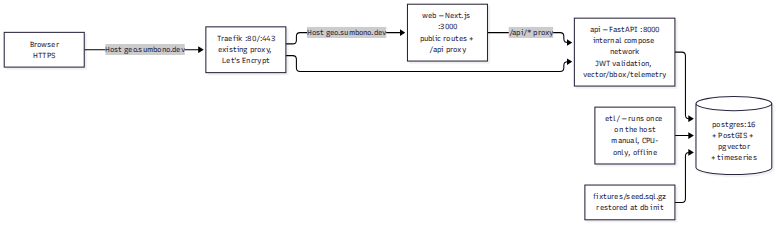
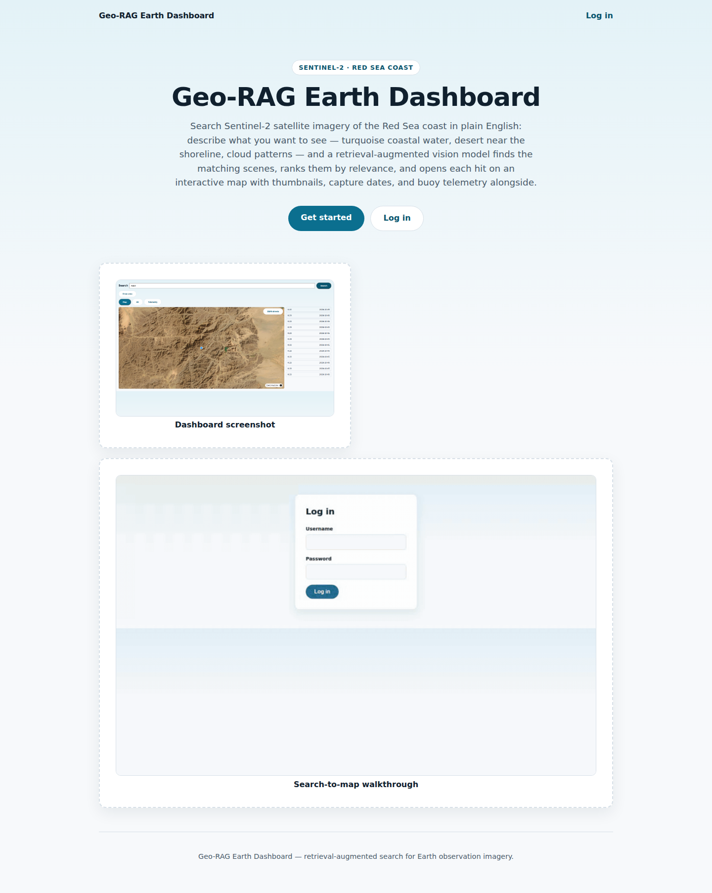
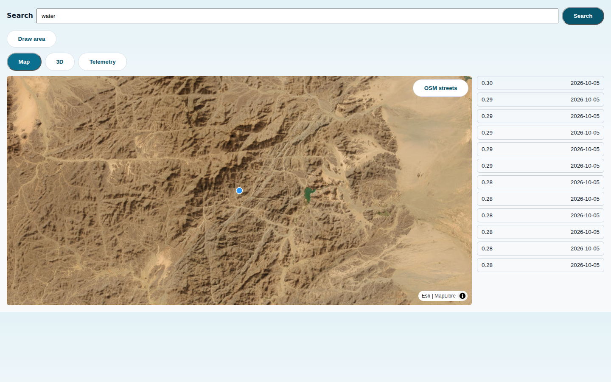
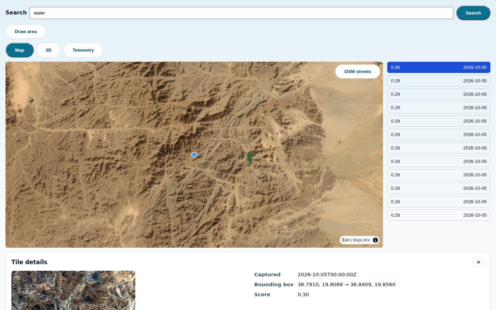
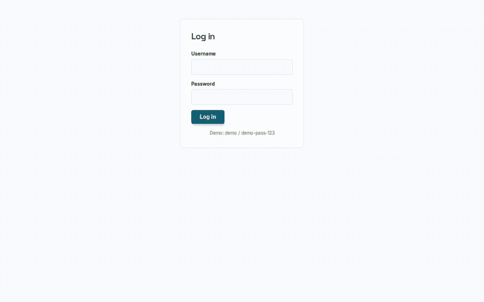

# Geo-RAG Earth Dashboard

[](https://github.com/sumbono/geo-rag-earth-dashboard/actions/workflows/ci.yml)

Search Sentinel-2 satellite imagery of the Red Sea coast in plain English:
describe what you want to see — turquoise coastal water, desert near the
shoreline, cloud patterns — and a retrieval-augmented vision model finds the
matching scenes, ranks them by relevance, and opens each hit on an
interactive map with thumbnails, capture dates, and buoy telemetry
alongside. Self-hosted with Docker Compose, for anyone cloning it.



## Quickstart

```bash
git clone https://github.com/sumbono/geo-rag-earth-dashboard.git && cd geo-rag-earth-dashboard && cp .env.example .env && docker compose up -d
```

**Expected wait:** roughly 2–5 minutes on a first run — building the images
dominates; the database seeds itself in seconds. The quickstart works
offline after the images exist: there is **no manual seeding and no ETL to
run** — the committed fixture dump (`fixtures/seed.sql.gz`) is restored
automatically the first time Postgres starts.

Verify the stack is up:

```bash
docker compose logs db | grep "02-seed: restored"   # fixture dump restored
# then open http://localhost:3000 and log in (below)
```

Two honest notes on the first run:

- **First search downloads model weights.** The default `ENCODER=remoteclip`
  fetches the 578 MB RemoteCLIP checkpoint inside the api container on the
  first query (~15–30 s, once per fresh container); every search after that
  is fast (measured p95 in [docs/benchmarks.md](docs/benchmarks.md)). Set
  `ENCODER=fake` in `.env` before `up` to run fully offline with a
  deterministic stand-in encoder.
- `docker compose down` stops the stack; `docker compose down -v &&
  docker compose up -d` resets the database and re-restores the fixture
  dump.

## Demo credentials

| Username | Password     |
| ---------- | ------------ |
| `demo`     | `demo-pass-123` |

This is the documented public default (`DEMO_USER` / `DEMO_PASSWORD` in
`.env`, seeded on first boot) — change both before exposing the stack
beyond localhost, along with `JWT_SECRET` / `REFRESH_SECRET`.

## Screenshots

Landing page:



Dashboard after a search — ranked results with scores and capture dates
beside the satellite basemap:



Tile detail panel — thumbnail with true/false-color toggle, capture time,
bounding box, and relevance score:



Search-to-map walkthrough (login → search → detail → area draw →
telemetry), recorded from the end-to-end flow:



The screenshots and GIF are regenerated from the live stack with
`npx playwright test e2e/recording.spec.ts`, then assembled into a GIF by
`apps/web/scripts/make_gif.py` (see either file's header for the how and
why — the spec also documents why not Playwright video).

## Optional: re-run the ETL (data enrichment)

Everything above runs off the committed fixture dump (100 embedded tiles +
telemetry). The ETL is optional — re-run it when you want fresh scenes
from source (Earth Search STAC, Red Sea window):

```bash
python -m venv .venv && . .venv/bin/activate
pip install -r apps/api/requirements.txt -r etl/requirements.txt   # etl/requirements.txt carries the ML stack (torch CPU, open-clip, huggingface-hub)

# One-command pipeline: STAC query → chip extract → embed → telemetry → pg_dump
# (writes fixtures/seed.sql.gz + fixtures/seed.manifest.json)
python etl/make_fixture_dump.py --tiles 100
```

Or stage by stage:

```bash
# 1. scenes → $ETL_CACHE_DIR/manifest.json (add --download-assets for TIFFs, ~450 MB/scene)
python etl/download_sentinel2.py --bbox 34.5 16.5 40.0 29.0 --max-scenes 40 --cloud-cover 20

# 2. chips → data/thumbs/*.jpg + chips_manifest.jsonl (library: etl/extract_chips.py)

# 3. embeddings → Postgres tile rows
ENCODER=remoteclip python etl/embed_remoteclip.py --manifest data/thumbs/chips_manifest.jsonl --batch 16

# 4. buoy telemetry demo series
python etl/seed_telemetry.py
```

Notes:

- **`ENCODER=remoteclip` is the real encoder**: first use downloads the
  578 MB RemoteCLIP ViT-B/32 checkpoint (cached afterwards). `ENCODER=fake`
  skips the download for dry runs.
- Inside compose, thumbnails are served read-only from `fixtures/thumbs`;
  copy new JPEGs there (`cp data/thumbs/*.jpg fixtures/thumbs/`) to see
  them in the UI.
- A regenerated dump is restored on the next **fresh** database volume —
  `docker compose down -v && docker compose up -d` re-seeds (this resets
  demo data).

## Security

Authentication is cookie-based JWT with rotation:

- `POST /api/auth/token` (OAuth2 password grant) issues a **15-minute
  access JWT** in an `httpOnly`, `SameSite=Strict` cookie, plus a **7-day
  rotating refresh token** — opaque, stored hashed, rotated on every use.
  Replaying an already-rotated refresh token revokes the entire token
  family for that user and answers `401`.
- Every `/search/*` and `/telemetry/*` route requires a valid, unexpired
  token whose user still exists; missing/invalid/expired → `401`.
- Rate limits: **5/min per IP** on login and refresh, **60/min per IP** on
  the search and telemetry APIs.

Unauthenticated API call:

```console
$ curl -i -X POST http://localhost:3000/api/search/vector
HTTP/1.1 401 Unauthorized
Content-Type: application/json

{"detail":"Not authenticated"}
```

## Benchmarks

Measured numbers, budgets, and methodology live in
[docs/benchmarks.md](docs/benchmarks.md) (n=50 on the deployment host;
end-to-end search p95 **181.8 ms** vs the 800 ms budget). The doc keeps the
full history honestly: the first benchmark run **found** a per-request
encoder reload (p95 2294.6 ms, FAIL), ruling **R15 fixed** it with
process-level memoization, and the **re-measured** run passes —
found → fixed → re-measured.

## Live demo

**https://geo.sumbono.dev** — deploying.
